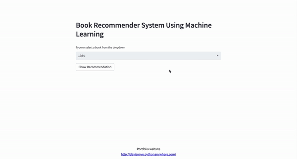

# KNN Implementation

The k-nearest neighbors algorithm, also known as KNN or k-NN, is a non-parametric, supervised learning classifier, which uses proximity to make classifications or predictions about the grouping of an individual data point.

Link to article

https://medium.com/@davisonyeas/putting-the-k-in-nn-479859ad8414

## APPLICATIONS in MACHINE LEARNING

KNN is widely used in machine learning applications. Some of the most famous use cases are mentioned below.

RECOMMENDATION ENGINE

A recommendation engine provides product suggestions or services to the user based on the data. KNN has been used in the recommendation system to identify items or products based on the user’s data. However, it is unsuitable for high dimensional data due to computation. However, it is an excellent choice for the baseline approach.

e.g Book Recommendation System

  

PATTERN RECOGNITION

KNN is used to identify the patterns in text or images. For example, it is used to identify handwritten digit recognition, detect patterns in credit card usage and image recognition.

CONCEPT SEARCH

Concept search involves searching semantically similar documents and classifying documents containing similar topics. In today’s world, data is generated exponentially, and it creates tons of documents. Each of those documents contains key concepts. Assume we have a use case to extract these key concepts from the set of documents, and these documents contain a vast amount of data. To find the key concepts from the data, we use the KNN algorithm.

MISSING DATA IMPUTATION

Data sets frequently have missing values, which creates a problem for machine learning models or analysis. We need to replace the missing values before doing modeling or analysis. KNN is an effective algorithm for imputing the missing values in a process that’s called “nearest neighbor imputation.”

BANKING

KNN is widely used in banking and financial use cases. In the banking sector, it helps to predict whether giving a loan to the customer is risky or safe. In financial institutes, it helps to predict the credit rating of customers.

Computing K-Nearest Neighbor Distance Metrics 

EUCLIDEAN DISTANCE

Euclidean distance is the most popular distance measure. It helps to find the distance between two real-valued vectors, like integers or floats. Before using Euclidean distance, we must normalize or standardize the data, otherwise, data with larger values will dominate the outcome.

HAMMING DISTANCE

Hamming distance is mostly used in text data, which calculates the distance between two binary vectors. Here, binary vector means the data represented in the form of binary digits 0 and 1. It is also called binary strings.

MANHATTAN DISTANCE

Manhattan distance is the simplest measure, and it’s used to calculate the distance between two real-valued vectors. It is called “Taxicab” or “City Block” distance measure.
If we start from one place and move to another, Manhattan distance will calculate the absolute value between starting and destination points. Manhattan is preferred over Euclidean if the two data points are in an integer space.

MINKOWSKI DISTANCE

Minkowski distance is used to calculate the distance between two real value vectors. It is a generalized form for Euclidean and Manhattan distance. In addition, it adds a parameter “p,” which helps to calculate the different distance measures.

## Advantages

- It’s simple to implement.
- It’s flexible to different feature/distance choices.
- It naturally handles multi-class cases.
- It can do well in practice with enough representative data.

## 🤝 Contribution
Feel free to file a new issue with a respective title and description on the this face recognition repository. If you already found a solution to your problem, I would love to review your pull request!

## ❤️ Owner
Made by Davis Onyeoguzoro

## Connect

Feel free to mail me for any doubts/query ✉️ davisonyeas1@gmail.com

Follow me on LinkedIn, https://www.linkedin.com/in/davis-onyeoguzoro/

Follow me on Medium, https://medium.com/@davisonyeas

Portfolio Website, **[Portfolio Website](http://davisonye.pythonanywhere.com/)**